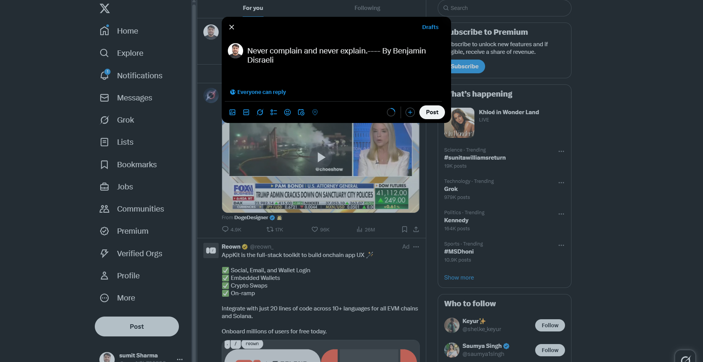

# Random Quotes Generator

## Overview

The Random Quotes Generator is a simple and useful application that provides users with randomly generated inspirational, motivational, or humorous quotes. This app is perfect for those looking for a daily dose of wisdom or entertainment.

## Features

- Generates random quotes with each button click.
- Displays the quote and author.
- User can copy the quote and author.
- Background image can we download.
- Background image can we canged when we referesh the page.
- User-friendly interface.
- Option to share quotes on Twitter.
- Lightweight and fast performance.

## Technologies Used

- HTML
- CSS
- JavaScript
- API : Quotes API

## Project Image

<!-- uplaod iamge -->

<!-- Responsive -->
## Responsive

## Preview of the App

- [App Link](https://random-quotes-generator-r2eirak35.vercel.app)

## Source Code Link

- [Github Link](https://github.com/sumitkumarsharm/Chai_Aur_Cohort/tree/main/Master%20ji)

## Acknowledgments

- [Quotes API](https://api.freeapi.app/api/v1/public/quotes/quote/random)

## Usage

- Click the "Generate Quote" button to receive a new random quote.

- If sharing functionality is implemented, click the "Share" button to post on social media.
