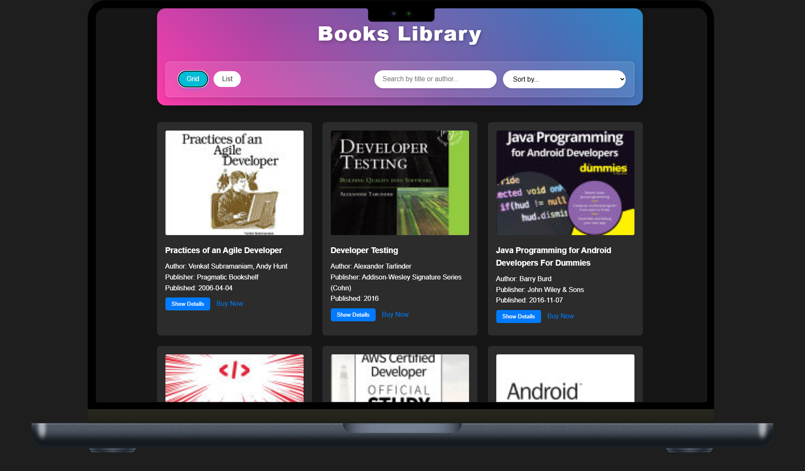
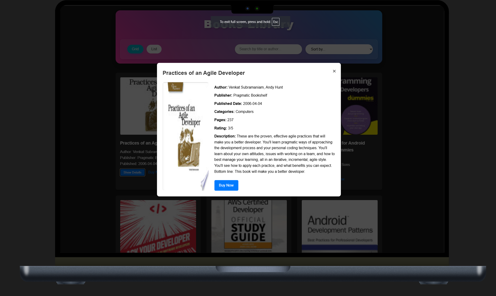
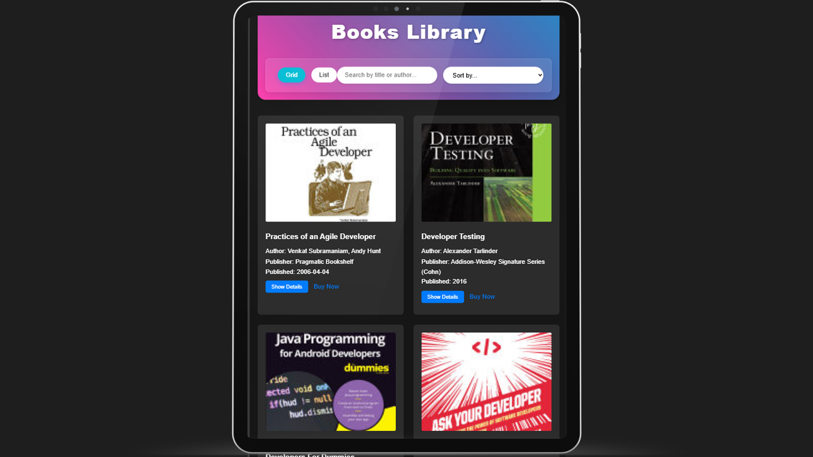
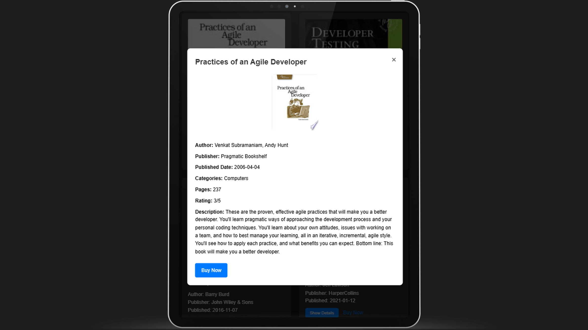
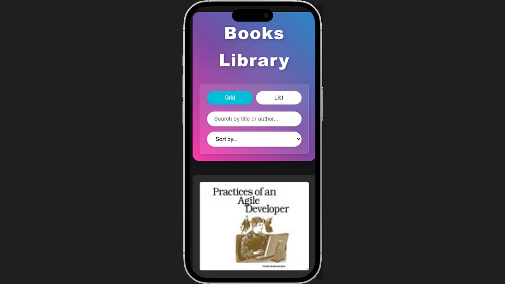
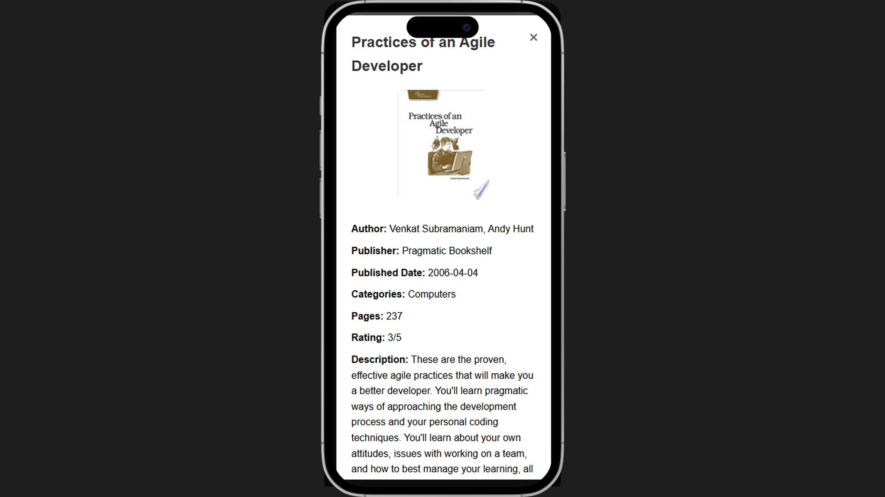

#  📕Book library

## 🛠️ Technologies Used

- HTML5
- CSS3
- JavaScript
- FreeApis

## 📱 Screenshots

### 🖥️Deasktop View

### 🖥️Desktop View

### Tablet View

### Tablet View

### Mobile View

### Mobile View

## 🎨 Features Details

### Search Functionality

- Real-time search results
- Search by book title or author name

### View Options

- Grid View: Displays books in a responsive grid layout
- List View: Shows books in a detailed list format

### Book Details

- Book cover image
- Title and author information
- Publication details
- Book description
- Direct link to purchase/more information

## 🌐 API Integration

The application uses the FreeApi to fetch book data. Each request returns:

- Book title
- Author information
- Publication details
- Book cover images
- Description
- Purchase links

## 📱 Responsive Design Features

### Desktop View (1024px and above)

- Grid layout shows 4 books per row
- Full navigation menu
- Enhanced hover effects
- Detailed book information
- Large book cover images

### Tablet View (768px to 1023px)

- Grid layout adjusts to 2-3 books per row
- Optimized control panel layout
- Responsive search and sort options
- Adapted modal view for medium screens
- Touch-friendly buttons

### Mobile View (below 768px)

- Single column layout
- Collapsible search and sort controls
- Stack view for better readability
- Optimized touch targets
- Full-width book cards
- Simplified navigation
- Easy-to-read typography

### Cross-Device Features

- Smooth animations
- Flexible images
- Touch-friendly interface
- Optimized loading times
- Adaptive layout system
- Seamless view switching
  The application is fully responsive and works on:
- Desktop computers
- Tablets
- Mobile phones

## 👥 Contributing

1. Fork the repository
2. Create your feature branch ( git checkout -b feature/AmazingFeature )
3. Commit your changes ( git commit -m 'Add some AmazingFeature' )
4. Push to the branch ( git push origin feature/AmazingFeature )
5. Open a Pull Request

## 📧 Contact

- Email: - sumitkumarsharma2748@gmail.com

- LinkedIn: - https://www.linkedin.com/in/sumitsharma2748/

- Project Link: - https://chai-aur-cohort.vercel.app/
